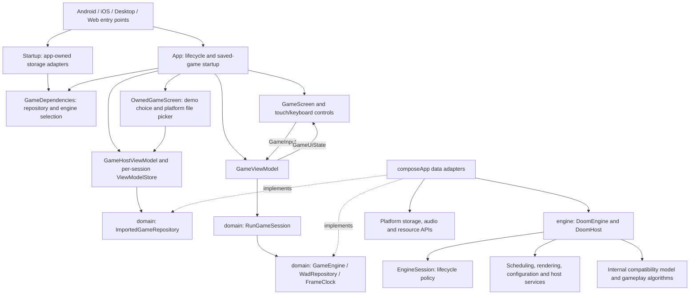

# Architecture

The application separates presentation, application policy, engine internals and
platform adapters. MVVM governs UI state. A public `DoomEngine` instance owns its
complete runtime. Starting or restarting a session creates fresh engine state.

## Dependencies

- `:domain` owns application contracts, game selection, import validation and
  session policy. It depends on Kotlin and coroutines, with no Compose, platform
  or engine dependency.
- `:engine` owns the original simulation, binary data structures, rendering and
  engine-owned host ports. It depends on Kotlin and coroutines, with no application or
  presentation dependency.
- `:composeApp` implements the domain ports in `data`, chooses implementations in
  `di`, and exposes UI state and views in `presentation`. Platform source sets
  implement audio, storage, pixel uploads and host entry points.
- `:androidApp` and `iosApp` remain packaging/host projects.

`verifyArchitecture` checks forbidden references in common production sources.
Module dependencies also prevent domain or engine code from importing the app.
The engine enables Kotlin's strict explicit API mode. Its implementation types,
generated tables and compatibility functions are `internal`; public facade,
host/input contracts, metrics, errors and constants declare their visibility and
types explicitly. The architecture task also rejects core dependencies outside
the existing compatibility implementations listed in
`gradle/engine-compatibility-sources.txt`. That inventory records remaining
coupling; new services and models must use focused collaborators. Package-based
checks reject renderer geometry calls from gameplay/world/savegame code and direct
scheduling calls from rendering code. State holders cannot receive the core.

## Kotlin source layout

Each named class, interface, object, enum, annotation class and typealias lives
in its own `TypeName.kt` file. This applies to production code, generated named
types and test fixtures, including helpers that were previously nested. Named
sealed variants are separate files in the same package. Anonymous objects and
companion objects may remain with their owning type. Types and filenames use
PascalCase (UpperCamelCase), including files containing only functions or
constants, such as `GameLoop.kt` and `BinaryReaders.kt`. Package declarations
match directories beneath each source set's `kotlin/` directory. Engine functions,
properties and local variables use lowerCamelCase; compile-time constants use
UPPER_SNAKE_CASE. Original C names remain in documentation and data strings
where their values matter to compatibility.

`verifyKotlinSourceLayout` checks the type count, names and package paths
separately from dependency checks, and runs through `verifyArchitecture` in CI.
It also checks engine member names and rejects Kotlin suppression annotations.
Classless platform adapters may retain a recognized platform suffix such as
`.wasm.kt`. Swift views also use one struct per matching file, and JavaScript
test fixtures use one named class per matching file. The file split preserves
responsibilities, algorithms and runtime
behavior. Package organization makes responsibilities and permitted references
visible, but does not remove shared-state dependencies in existing algorithms.

The suppression cleanup removes all 185 engine suppression annotations and fixes
the issues they covered: dead values, unnecessary mutable locals, unreachable
branches, redundant conversions, parameter shadowing and unused arguments. All
37 direct parameter/local shadows were removed. Kotlin builds enable
`extraWarnings` and `allWarningsAsErrors`; Gradle Kotlin scripts and Android lint
also treat warnings as errors. Required Wasm APIs use their actual opt-in markers.
These rules expose future diagnostics; they do not prove the complete engine
has no remaining design problems.

## Engine package map

The public API remains in `doom.engine`; its 15 root files retain their names.
Implementation files now live in responsibility-based packages. The migration
moves 203 files, splits two mixed-responsibility files, and renames 78 internal
types, for example `Actor`, `TicCommand`, `FixedPoint` and `BinaryAngle`.
These names and locations do not change the represented binary data.

| Package under `doom.engine` | Responsibility |
| --- | --- |
| Root public API | `DoomEngine`, typed input and host ports, metrics, errors and host-facing constants. |
| `core` | `DoomEngineCore`, `LegacyEngineRuntime`, game-loop orchestration and platform bindings. |
| `gameplay` and its `actors`, `player`, `weapons`, `interactions` subpackages | Game/session rules, actor definitions and actions, movement, weapons and item interactions. |
| `world` and its `collision`, `visibility`, `specials`, `movers`, `lighting` subpackages | Map records/loading, spatial operations, sector effects and moving geometry. |
| `rendering` and `rendering.resources` | Framebuffers, palette/wipes, scene passes and rasterization; texture/sprite resources. |
| `audio`, `resources`, `savegame` | Sound definitions/playback; WAD archives, binary readers and strings; save serialization. |
| `geometry`, `simulation`, `input`, `runtime` | Fixed-point/BSP math; tick/thinker scheduling and randomness; input buffering; lifecycle, clock and host attachment. |
| `configuration`, `capture` | Settings/startup arguments and screenshot encoding. |
| `menu`, `hud`, `statusbar`, `automap`, `intermission`, `finale`, `cheats` | Original in-game interfaces, presentation sequences and cheat decoding. |

Generated definitions and lookup tables live with their consumers, rather than
in a flat `gen` directory: actor data in `gameplay.actors`, sound data in `audio`,
trigonometric tables in `geometry`, gamma tables in `rendering`, and strings in
`resources`. The tables and algorithms originate from linuxdoom-1.10; see
[NOTICE](NOTICE) and [PORTING.md](PORTING.md).

## Responsibilities and SOLID

| Principle | Application |
| --- | --- |
| Single responsibility | The composition root selects platform repositories and engine adapters; screens render state and emit input; ViewModels own import/session presentation state; `RunGameSession` drives one session; repositories load or store; the adapter connects one engine to its host. |
| Open/closed | New WAD repositories, frame clocks, storage implementations and engines implement existing contracts and are selected in `GameDependencies`. |
| Liskov substitution | Fake engines/repositories exercise the same startup, input, quit and cleanup contract as the real adapter. `close()` is safe after partial startup and repeated calls. |
| Interface segregation | Resource loading, storage, frame pacing and engine lifecycle have separate small interfaces. Audio returns a resource handle with explicit cleanup. |
| Dependency inversion | The domain defines its ports; outer adapters implement them. The engine defines clock/storage/video/sound host interfaces. Presentation does not access internal engine state. |

These are concrete design choices, not a claim that every internal algorithm is
fully SOLID. Compatibility algorithms still share a broad internal execution
context; further narrowing of those dependencies remains architectural work.

## Engine API and implementation boundaries

The application integrates through `DoomEngine`, `DoomHost`, `DoomInput` and
`DoomMetrics`, together with engine-owned clock, storage, video and audio ports.
Boot, stepping, pause, detach, resume and close are the facade's operations.
Typed key/mouse/joystick input replaces application access to internal
`input.EngineEvent` structures. The engine's C-compatible records and
compatibility functions are implementation details, not application extension points.
The concrete input types are `DoomKeyInput`, `DoomMouseInput` and
`DoomJoystickInput`, each declared in its own file beside `DoomInput.kt`.

`DoomEngine` composes `EngineSession` and a `LegacyEngineRuntime` adapter.
`EngineSession` owns lifecycle policy through separate execution, input, audio
and settings capabilities. The adapter binds those capabilities to the existing
simulation. `DoomEngineCore` remains the composition root and mutable model for
legacy algorithms; the extracted services neither receive it nor import it.
State-holder constructors no longer receive the entire core. Tables keep their
per-instance lazy allocation, including mutable actor definitions and menu data.

| Area | Object and responsibility | Dependencies |
| --- | --- | --- |
| Lifecycle | `EngineSession` gates boot, stepping and input; preserves music across detach; coordinates cleanup and terminal failures. | Execution, input, audio and settings capabilities; session clock, attachment and quit signal. |
| Host attachment | `HostAttachment` owns replaceable platform references and exposes storage, video, sound-effect and music capabilities. | `DoomHost`; its clock is kept separately for the session lifetime. |
| Time and exit | `EngineClock` owns one clock epoch and suspended-time accounting; `QuitSignal` represents an exit request. | An optional `DoomClock`; no UI callback is retained for quit. |
| Simulation timing | `TickScheduler` owns the private command ring, polling cadence and catch-up limits; `WorldTicker` owns level time and world-update order. | Clock/input/simulation contracts and world-update operations. |
| Thinkers | `ThinkerScheduler` owns insertion, traversal and deferred removal. | Thinker records; the sentinel remains available for legacy savegame traversal. |
| Rendering | `FrameBuffers` owns indexed screens and patch/block operations; `PaletteVideoOutput` owns palette expansion and its ARGB frame; `ScreenWipe` owns transition state. | A video port, framebuffer access and presentation randomness where needed. |
| Render coordination | `SceneRenderer` orders preparation, BSP, plane and masked passes with the original input checkpoints. | Render-pass capabilities and a polling callback; it has no scheduler or game-model dependency. |
| Geometry | `FixedGeometry` implements pure fixed-point angle/distance/side calculations; `BspQueries` performs explicit world-geometry lookup. | Coordinates, geometry records and immutable lookup tables. |
| Configuration | `StartupArguments` owns an argument snapshot and validation; `EngineConfiguration` handles reset, parsing and persistence through typed integer/string bindings. | Setting accessors and storage; no engine-wide context. |
| Capture | `PcxEncoder` encodes pixels; `PcxScreenshots` owns session screenshot numbering. | Pixel/palette data. |
| Menus | `MenuState` keeps descriptor tables and navigation links while requesting typed commands and page drawing separately. | `MenuCommandHandler` and `MenuPageRenderer`; `createMenuState` binds legacy menu functions. |
| Resources and input | `WadArchive` owns validated directory/cache state, `RandomSequences` owns independent simulation/presentation streams, and `EngineInputQueue` owns submission/dispatch queues. | Resource bytes and input values. |

The scheduling extraction preserves the existing two clock samples per timed
frame, input collection before backlog rejection, command lead limit, bounded
catch-up and single-tic counter ordering. Thinker traversal reads the next link
after a callback, preserving same-tic insertion and deferred removal. Gameplay
receives copies of buffered commands and cannot replace the scheduler's ring.
Geometry queries no longer overwrite the renderer's `viewx`/`viewy` to calculate
an angle. The existing zero-distance guard remains in distance calculation.

Screen-wipe inputs now match their complete-frame behavior: `captureStart()` and
`captureEnd()` use the owned framebuffer dimensions, and `advance(kind, ticks)`
accepts only the transition choice and elapsed tics. Unused rectangle parameters
and no-op finish stages are removed. Pixel-pair traversal, random consumption
and following-tick completion timing remain the compatibility requirements.

These are behavior-owning services, but they are not a complete rewrite of the
original engine. Gameplay, collision, savegame and low-level rasterization
algorithms still use core receiver functions to access shared mutable records.
Framebuffers expose borrowed pixel planes to the legacy rasterizer, and thinker
records retain their intrusive links for savegame compatibility. Removing core
backreferences from data holders limits accidental ownership; it does not by
itself establish encapsulation around those remaining algorithms. Further work
must move behavior and invariants behind focused collaborators, with gameplay
and rendering characterization kept intact.

## Startup and asset ownership

Each platform host explicitly calls `initializeApplication` before constructing
the UI. The [startup](https://github.com/kunal26das/startup) library (3.0.1) runs
`FileStorageInitializer` before `ImportedGameStorageInitializer` and caches only
their lightweight, application-owned repositories. Native imported-game storage
receives the same file adapter used for save/configuration files. Android's
adapter captures the application context, replacing the mutable global context
previously assigned by the Activity. Android uses manual `Startup.install`, so
these initializers do not need provider XML entries.

Initialization performs no file reads, database transactions or audio setup.
WAD restoration stays asynchronous in the host ViewModel; Wasm uses ordinary
initializers, never the unsupported blocking coroutine bridge. The returned
`GameDependencies` factory is passed into `App`, keeps constructor injection,
and creates fresh ViewModels, sessions and engine adapters. Startup lookups are
confined to the outer bootstrap; domain, engine and presentation code do not
depend on the library. Restart and lifecycle cleanup remain session-owned.

`App` observes `GameHostViewModel`, which restores the last locally imported
IWAD through the domain `ImportedGameRepository` port. A successful restore
launches the remembered game automatically. Without saved data, `OwnedGameScreen`
offers **PLAY DEMO**, which starts the bundled WAD, or **LOAD DOOM.WAD** through
a platform file picker. The web launcher also accepts
a local WAD dropped onto the page and exposes drag feedback through
`WadDropState`. Browser file reading and drag events stay in the platform adapter;
both picker and drop emit the same name/bytes callback to the host ViewModel.
Native targets retain the picker without advertising unsupported drop input.
The bundled resource is selected explicitly. The current checked-in `doom1.wad`
is the Ultimate DOOM data supplied in earlier project work; its filename and the
legacy PLAY DEMO label do not describe its edition. This architecture change does
not replace or add game assets.

The host ViewModel depends only on the repository interface.
`GameDependencies.createHostViewModel()` injects the initialized platform repository:
Web uses IndexedDB with binary `ArrayBuffer` records; Android, iOS and desktop
use `FileImportedGameRepository` with the platform's atomic file writes on an
I/O dispatcher. A versioned record stores the display name and WAD together,
and restoration validates the WAD again. The file is never uploaded.

`ImportedGameSelection` bounds data to 64 MB, validates the IWAD
identifier, directory/lump bounds, required Doom assets and a supported map
style, and copies the bytes into an owned snapshot. A successful import is
remembered before launching. If persistence fails, the ViewModel retains the
validated selection and exposes **PLAY FOR THIS VISIT** to launch it in memory.
A failed restore returns to the import screen with an error; it does not silently
substitute another game. Cancellation is propagated rather than shown as an error.

`GameHostViewModel.playDemo()` selects `BuiltInGameSelection`
without writing to the imported-game repository. The separately declared
selection retains the same bundled resource and storage namespace. An existing
remembered WAD
therefore remains available for automatic startup on the next visit.

`GameHostViewModel` owns an optional `GameEntry`, with a separate child ViewModel
store for each session. A restart reuses the selected WAD, clears the previous
store and creates a fresh entry. **CHOOSE GAME** clears the running entry and
returns to the demo/import screen; the remembered WAD is replaced only when
another import is successfully stored. The composition root supplies the selected WAD
repository, engine adapter and game-specific file repository. Resources remain
cached across lifecycle resumes. Imported saves and configuration use a stable
content-derived `wad-…-` prefix. The bundled selection retains its existing
storage namespace.

## Lifecycle and threading

`App` obtains a lifecycle-owned ViewModel and runs its session only while the host
is `RESUMED`. Compose supplies display pacing through `FrameClock`; the engine
continues to decide when to advance its original 35 Hz simulation.

The browser entry point supplies its own `BrowserGameLifecycleOwner`. Its DOM
adapter derives state from visibility and focus together on every relevant
event. A late visibility event therefore cannot pause a visible, focused game
after its focus event has already resumed it. Hidden and unfocused pages still
suspend the session; returning from the back-forward cache recomputes state.
A visible touch or pen event can also activate browsers that do not report
document focus; that activation is cleared on blur or page departure.
The owner and its event listeners are disposed with the web composition.

The application performs stepping, lifecycle calls and ViewModel changes on the
UI/game thread. The public engine input submission boundary also accepts input
from host threads through `EngineInputQueue`.
The mixer publishes complete channel snapshots to the platform audio thread;
mutable sample positions belong to that thread. Independent instance state does
not make arbitrary concurrent calls into one engine safe.

On cancellation, startup failure, normal quit or runtime error, `RunGameSession`
always closes the adapter. Detaching saves settings, stops legacy sound handles,
closes platform audio, pauses engine time, clears held/pending input and releases
host references. One cleanup failure does not
prevent other resources from being released. Original failures and cancellation
are preserved, with cleanup failures suppressed onto them.

Lifecycle resume reattaches resources to the same engine without booting again.
Replacing a host while active or paused first detaches its audio handles and
saves its settings, then restores music through the replacement. The original
clock epoch remains unchanged. Failure to release the old host is terminal and
does not start the replacement.
Screen transitions also tolerate repeated or backward clock samples, and stop
processing a large elapsed-time batch once their pixels are complete. A delayed
browser frame cannot force the melt to scan millions of already-finished ticks.
A failed or exited game remains terminal for its `GameViewModel`. The screen
then shows **RESTART**, which asks `GameHostViewModel` to create a fresh session
and engine, and **CHOOSE GAME**, which returns to the demo/import screen. Both
actions are hidden during startup and gameplay. A failure in one instance must not prevent
another from starting.

## Presentation and data ownership

The ViewModel publishes a read-only `StateFlow<GameUiState>` containing phase,
latest frame and an optional error. `GameFrame` validates dimensions and copies
the engine's reusable pixel buffer, so subsequent engine rendering cannot change
an already published frame. Consumers treat the snapshot as read-only.

Each view owns its platform bitmap converter, staging bytes and alternating
image buffers. Another screen cannot mutate its retained image. The view keeps
the last successful upload on a transient graphics exception, and renders the
original non-square pixels within a 4:3 rectangle. Error text is drawn above any previous
frame. Input views emit domain `GameKeyInput` and `GameMouseInput` values through
the `GameInput` contract. Touch gestures release held
keys in `finally` and when their controls leave composition.

`FrameBitmapConverter` is a common interface created through an expected factory
function with platform actual implementations. `AndroidFrameBitmapConverter`,
`IosFrameBitmapConverter`, `DesktopFrameBitmapConverter` and
`WebFrameBitmapConverter` each own their platform buffers. This uses ordinary
interfaces and platform factories instead of experimental expect/actual classes.

All targets use Compose 1.13.0-alpha01. Web uses its matching Skiko
0.152.0-alpha02 runtime, retaining the
[graphics-context lifetime fix](https://github.com/JetBrains/skiko/pull/1256).
The Compose plugin selects the runtime variant from the dependency graph;
the old browser-only version override and separate runtime configuration are
removed. Wasm linking rejects missing library symbols instead of deferring
incompatible calls to runtime. A build check compares the resolved Skiko compile
and runtime dependencies with the expected version. Dependency repositories use
the standard Gradle project APIs, shared through
`gradle/dependency-repositories.gradle.kts`.
The old global
bitmap-conversion heartbeat and synthetic-resize watchdog were removed:
conversion is not proof of presentation, and repeated surface recreation was
part of the upstream failure.

The browser-only `DoomGraphicsRecovery` adapter observes canvas context-loss
events and presents a DOM dialog independently of the failed graphics surface.
It never reloads automatically. The user's reload action keeps persisted WADs
and saves, but loses unsaved progress. Canvas listeners follow replacement and
page lifecycle; no rendering decisions enter the domain or engine layers.

The engine adapter translates logical input into `DoomInput` and supplies host
contracts. File and WAD repositories isolate resource APIs. `AudioMixer` extends
the engine's sound-effect/music capabilities with sample rendering. The adapter
receives a mixer factory rather than constructing `DmxSoundDriver` itself;
`GameDependencies` selects that implementation. Each attachment receives a fresh
mixer, while platform audio opening remains a separately supplied function.

## Verification and future work

The suppression cleanup passes 359 tests: 166 JVM, 142 Android host and 51
browser adapter tests. All six rendered-demo comparisons retain their expected
frame counts and hashes. Android packaging, both iOS Kotlin targets and the
production Wasm/Skiko build pass with compiler warnings treated as errors;
Android lint, including dependencies, reports no issues. Sixteen isolated guard
fixtures verify naming, suppression rejection and dependency boundaries. A
source audit finds no remaining parameter shadows or unused non-override
parameters in engine production code.

The rebuilt browser application launches, accepts menu input and renders a new
game after the full-frame wipe; no console errors or warnings were recorded.
These checks do not establish physical-device or multi-hour runtime coverage.
The build still exposes upstream Kotlin npm-resolution notices and Webpack's
default bundle-size hints; their causes and limits are recorded in
[AUDIT.md](AUDIT.md#suppression-and-toolchain-cleanup).

The preceding package/name migration passed 166 JVM tests: 94 engine, 21 domain
and 51 application tests. All six rendered-demo frame counts and pixel hashes
remained unchanged. Architecture checks and the strengthened layout guard passed
across 396 Kotlin files. A token comparison of all 4,087 production top-level
declarations found identical content after the intended identifier renames,
excluding imports, comments and whitespace while retaining string contents.
An independent review of the moved and split declarations found no omissions.
Android debug packaging, application/engine Kotlin compilation for iOS arm64 and
simulator arm64, and the production Wasm distribution also passed, including the
Skiko runtime compatibility check. These are build results, not linked iOS app
or physical-device runtime validation.

The earlier one-type-per-file cleanup passed 163 JVM tests: 91 engine, 21 domain
and 51 application tests, including all six rendered-demo comparisons with the
pre-refactor engine. Its layout guard passed across 391 Kotlin files, and an
independent syntax-tree scan confirmed one named type per matching file. Android
packaging, both iOS Kotlin targets and the production Wasm build passed. Swift
syntax and Xcode source membership were also checked. [AUDIT.md](AUDIT.md)
separates those results, the later browser-freeze checks, and verification of the
package/name migration. Historical results are not a suppression-cleanup pass
or a physical-device test.

Domain and ViewModel tests cover frame ownership, cancellation/resume, input
gating, terminal failures and quit. Import/storage tests cover remembered
startup, structural validation, persistence failure, replacement and cleanup.
Engine tests characterize complete bundled demo playback, independent engines,
invalid archives/options, fixed-point behavior and host cleanup. Canonical demo
expectations live in `BundledDemoRegressionTest` and `InstanceIsolationTest` and
correspond to the current bundled fixture. They establish selected behavior of
this Kotlin port, not independent equivalence to the DOS executable.

New focused tests exercise lifecycle failure cleanup, private command copying,
fake-clock scheduling, thinker mutation order, level-time pause behavior,
independent menu command/drawing capabilities, geometry without camera mutation,
indexed frames, palette expansion, wipe transitions, typed configuration,
argument snapshots and PCX encoding. Render-pass tests preserve the input
checkpoint order. Simulation hashes alone are insufficient because their
harness disables drawing and advances single tics; timed scheduling and rendered
frames require their own checks. Multiplatform compilation and runtime smoke
checks remain necessary after moving shared code.

`RenderedDemoRegressionTest` runs all three bundled demos through the public API
in both single-tic and timed modes. Its expected end tics, frame counts and sampled
ARGB hashes were captured from the pre-refactor binary. The six cases preserve
that baseline, including the screen transitions, without deriving expectations
from the implementation being tested.

Earlier campaign smoke checks loaded and rendered each map in a locally supplied
Ultimate DOOM WAD; they did not complete a campaign playthrough. Earlier browser
checks exercised file import, drag/drop, remembered startup, resize stress and an
explicit context-loss recovery action. Those records do not establish the
current refactor's results or multi-hour stability on every browser.

Remaining work includes narrowing gameplay/collision/rasterizer dependencies,
format-specific map/save/demo validation, multiplayer, physical-device audio and
interruption checks, and detecting rendering stalls without a context-loss event.
See [AUDIT.md](AUDIT.md) for the implementation record and limitations.

The multiplatform ViewModel and lifecycle wiring follows the official
[ViewModel](https://kotlinlang.org/docs/multiplatform/compose-viewmodel.html) and
[lifecycle](https://kotlinlang.org/docs/multiplatform/compose-lifecycle.html)
documentation.
